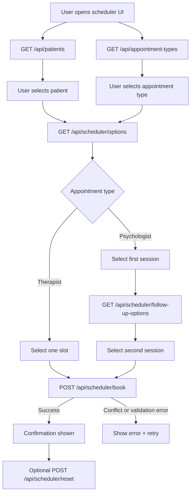

# Prosper Appointment Scheduler | Take Home

I used Next.js since I wanted to utilize the built-in router as a quick server. No DB though, only mocked data and in-memory runtime state. The business logic is mostly all in `engine.ts`. 
I hosted the app on vercel as well for a quick peak https://prosper-scheduler.vercel.app/

--- 
A couple of things:
- I picked some elements from the landing page to guide the styling
- I added more mock patients and more slots and clinicians
- didn't inlcude THERAPY_SIXTY_MINS since it's not bookable online
- I assumed that if a client books a psychologist appointment that there second setion has to be with the same psychologist
  

## Architecture



## Route Map

All routes live under `app/api`.

- `GET /api/patients`
  - Returns all mock patients.
- `GET /api/appointment-types`
  - Returns scheduling tracks and durations.
- `GET /api/scheduler/options?patientId=...&schedulingTrack=...`
  - Returns first-step slot options.
  - For psychologist requests, also returns `optionsByClinician`.
- `GET /api/scheduler/follow-up-options?patientId=...&firstSlotId=...`
  - Returns valid second assessment-session options.
- `POST /api/scheduler/book`
  - Creates booking after full rule + capacity validation.
- `POST /api/scheduler/reset`
  - Resets runtime bookings and generated runtime appointments.

--
## To start app locally

```bash
npm install
npm run dev
```
Open [http://localhost:3000](http://localhost:3000).

--

---
1. Select a mock patient -> that's as if the user has authed (didn't authenticate since it would be an overkill/not needed)
2. Selecting a scheduling track (`THERAPIST` or `PSYCHOLOGIST`) and didn't include the 
3. Choosing valid slot(s) after they have been optimized (filtered out 15-mins intervals..etc)
4. Booking confirmed and is stored in-memory on the server process (no DB)* 

---

## Requirement Coverage

### Task 1: Assessment Slots Grouped By Clinician

- Eligibility is enforced by patient state + insurance.
- Psychologist options are grouped by clinician in API output (`optionsByClinician`).
    - optionsByClinician is needed for psychologist-specific logic (same clinician, valid 2-session pairing).
      
- Valid assessment pairs are generated where:
  - both sessions are 90 minutes
  - sessions are on different days
  - second session is after the first
  - second session is no more than 7 days after the first

### Task 2: Slot Optimization For Throughput

- A reusable optimizer function keeps non-overlapping slots that maximize appointment count for a day:
  - `optimizeSlotsForMaxAppointments(startsAtList, durationMinutes)`
- Psychologist first-session slots are optimized before pairing.

### Task 3: Capacity Constraints

- Clinician limits are enforced in slot offering and booking validation:
  - `maxDailyAppointments`
  - `maxWeeklyAppointments`
- Existing appointments + newly booked runtime appointments are used for counts.
- Booking is rejected when selected slots would exceed limits.

---

## Tests

Engine-focused tests are in:
- `models/scheduler/engine.test.ts` (not all cases covered and I know they were optional) 

They cover:

- Task 2 optimization example (overlapping 90-minute slots)
- Grouped assessment pair validity
- Weekly capacity rejection for psychologist pair booking

Run tests:

```bash
npm test
```

## Mock Data Reference

### Starter Scenario 

One patient+psychologist scenario is intentionally mirrored from the official starter/Notion data and used directly in this app:

- Patient ID: `patient-byrnehollander`
- Psychologist ID: `clinician-psychologist-doe`
- Slots: sourced from the starter slot dataset and mapped into this app format + expanded a bit with more slots to highlight the slot optimization

Implementation file:

- `models/scheduler/mock-data.ts`

### 4 mock patients 

- `Byrne Hollander` (`NY`, `AETNA`)
- `Alex Rivera` (`CA`, `CIGNA`)
- `Milana Shah` (`TX`, `UNITED`)
- `Olivia Morgan` (`FL`, `BCBS`)

in `models/scheduler/mock-data.ts`:

Each patient object has:

- `id`: unique patient identifier used in API calls
- `firstName`, `lastName`: display name fields
- `state`: patient home state (used for eligibility)
- `insurance`: payer (used for eligibility)
- `avatar`: short initials for UI display
- `createdAt`, `updatedAt`: ISO timestamps

### 4 mock clinicians:

- Therapists:
  - `Amelia Rodriguez` (licensed in `NY`, `FL`; accepts `AETNA`, `BCBS`)
  - `Noah Nguyen` (licensed in `CA`, `TX`; accepts `CIGNA`, `UNITED`)
- Psychologists:
  - `Jane Doe` (licensed in `NY`, `CA`; accepts `AETNA`, `CIGNA`) 
  - `Priya Patel` (licensed in `TX`, `FL`, `NY`; accepts `UNITED`, `BCBS`, `AETNA`)

Each clinician object has:

- `id`: unique clinician identifier
- `firstName`, `lastName`: display name fields
- `states`: licensed states
- `insurances`: accepted payers
- `clinicianType`: `THERAPIST` or `PSYCHOLOGIST`
- `appointments`: existing booked appointments in seed data
- `maxDailyAppointments`: per-day capacity cap
- `maxWeeklyAppointments`: per-week capacity cap
- `availableSlots`: raw schedulable slots before filtering/optimization
- `createdAt`, `updatedAt`: ISO timestamps

### Available Slots

Available slots are stored under each clinician as:

- `id`: unique slot identifier
- `clinicianId`: owning clinician
- `date`: ISO datetime start time
- `length`: slot duration in minutes (`60` for therapist intake, `90` for psychologist assessment sessions)
- `createdAt`, `updatedAt`: ISO timestamps (changed to ISO because it serialize cleanly while date objects don't survive serialization-- didn't want to use .getTime() all over the place.) 
